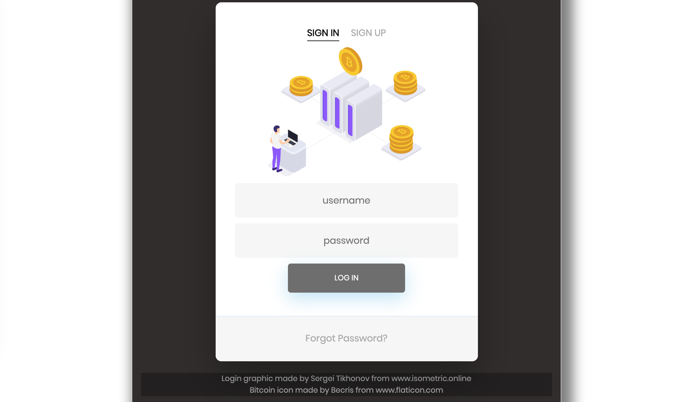
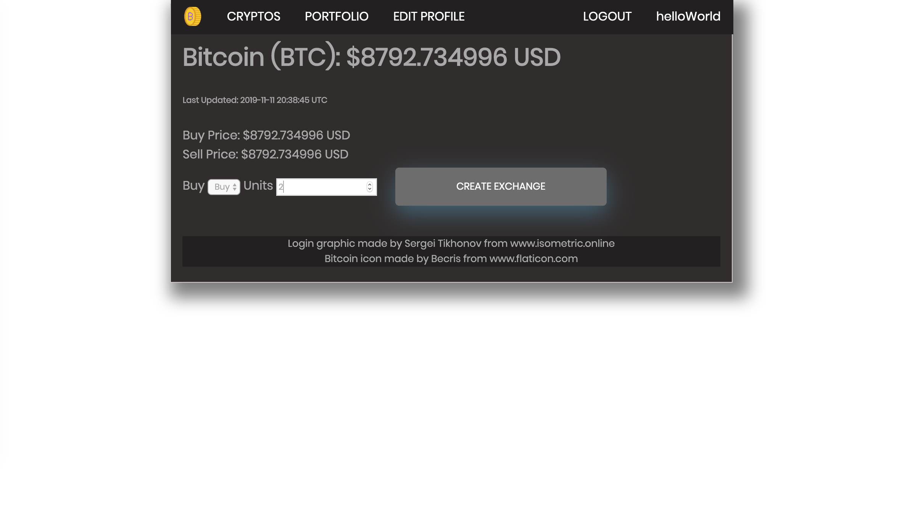
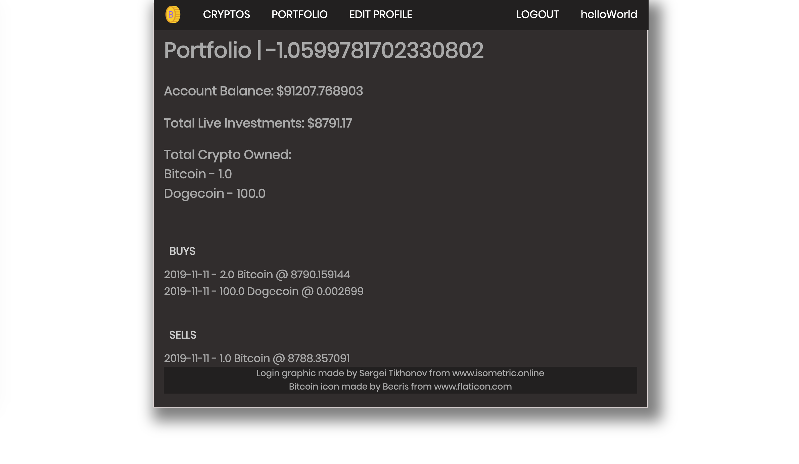
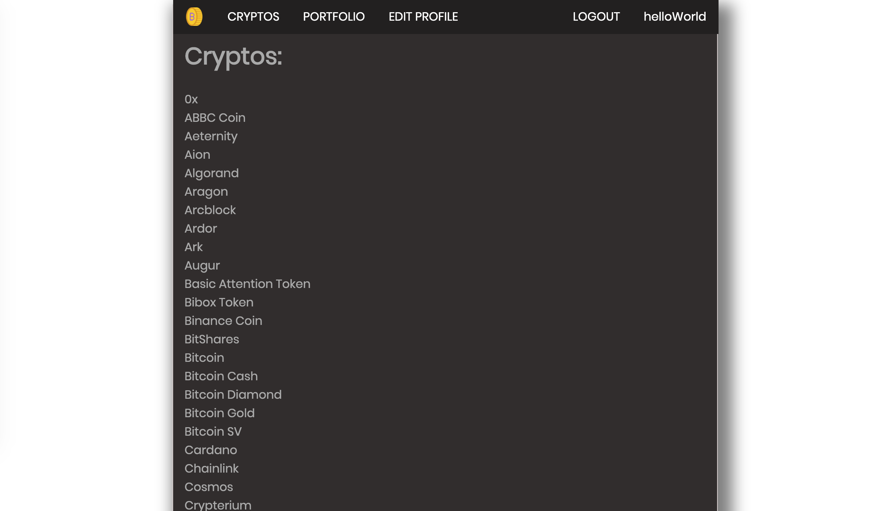

# README

## Crypto Hero

Crypto Hero is a crypto currency trading simulator.
Users can create buy and sell orders with the top 100 crypto currencies in the world. Market prices are updated in real time using CoinCap API.

### Screenshots

## Installation

1. Clone the repo and CD to the directory
2. run bundle install in your terminal
3. rails db:create to create a Postgres database
4. rails db:seed to seed crypto data
5. Finally, run rails s to start the server!

## Tutorial

1. First visit the home page and create an account
2. To check out the current crypto currencies up for purchase, click on the 'cryptos' tab
3. To see all the exchanges that have been made on your account, click 'portfolio'. This page will also list the current value of all investments, and current bank account
4. To edit your profile with a profile picture, or blurb about yourself, click on 'edit profile'

### Tech

1. Ruby on Rails
2. Vanilla CSS

### API

CoinCap is a useful tool for real-time pricing and market activity for over 1,000 cryptocurrencies.
Crypto Hero uses CoinCap for seeded data of the top 100 crypto currencies and to frequently update currency prices.
[CoinCap Api](https://docs.coincap.io/?version=latest)
